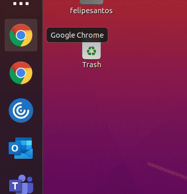

# Felipe Santos's dotfiles <!-- omit in toc -->

[](https://gitpod.io/#https://github.com/felipecassiors/dotfiles#scripts)

Bootstrap your Ubuntu in a few minutes!

This dotfiles repository is currently aimed for [**Ubuntu for WSL**](https://ubuntu.com/wsl), **Ubuntu Server** and **Ubuntu Desktop**, tested only in **Ubuntu 20.04**. See how to get started with WSL [here](https://docs.microsoft.com/pt-br/windows/wsl/install-win10).

This repository is managed with [`chezmoi`](https://chezmoi.io).

## Summary <!-- omit in toc -->

- [Get started](#get-started)
  - [Using the convenience script](#using-the-convenience-script)
    - [Usage](#usage)
    - [Examples](#examples)
  - [Manually](#manually)
- [`scripts/`](#scripts)
  - [`create_alternative_chrome_shortcut.sh`](#create_alternative_chrome_shortcutsh)
    - [Usage](#usage-1)
    - [Examples](#examples-1)
    - [Demo](#demo)

## Get started

The current state of this dotfiles uses the zsh theme [Powerlevel10k](https://github.com/romkatv/powerlevel10k), so it requires you to install a font on your host machine with support for [Nerd Fonts](https://github.com/ryanoasis/nerd-fonts). Currently I use `FiraCode NF`, and you can install it on Windows with [Chocolatey](https://chocolatey.org/install):

```powershell
choco install firacodenf
```

Now you will learn how to bootstrap this repository on your machine.

### Using the convenience script

You can use the [convenience script](./clone_and_install.sh) with, it will install Git in case you don't have it already:

```bash
sh -c "$(wget -qO- https://git.io/felipecassiors-dotfiles)"
```

> 💡 We use `wget` here because not all systems comes with `curl` installed. But the `curl` version of it is:
> ```bash
>  sh -c "$(curl -fsSL https://git.io/felipecassiors-dotfiles)"
> ```

#### Usage

The convenience script supports two environment variables:

- `DOTFILES_REPO`: Default to `felipecassiors`.
- `DOTFILES_BRANCH`: Default to `master`.

#### Examples

- Using the convenience script to clone the dotfiles repository on branch `beta`:

  ```bash
  DOTFILES_BRANCH=beta sh -c "$(wget -qO- https://git.io/felipecassiors-dotfiles)"
  ```

### Manually

You can also do it manually, it's simple after all.

```bash
git clone https://github.com/felipecassiors/dotfiles "$HOME/.dotfiles"
"$HOME/.dotfiles/install"
```

## [`scripts/`](scripts/)

If you already have this repository [bootstrapped](#get-started) in your machine, you can use the scripts right away. Or, if you want to run it directly, you can use:

```bash
bash -c "$(curl -fsSL "https://raw.githubusercontent.com/felipecassiors/dotfiles/master/scripts/<script-name>")" -- <arguments>
```

Just replace `<script-name>` and `<arguments>` with the desired values. Example:

```bash
bash -c "$(curl -fsSL "https://raw.githubusercontent.com/felipecassiors/dotfiles/master/scripts/create_alternative_chrome_shortcut.sh")" -- --force
```

### [`create_alternative_chrome_shortcut.sh`](scripts/create_alternative_chrome_shortcut.sh)

#### Usage

```sh-session
$ scripts/create_alternative_chrome_shortcut.sh --help
Usage: scripts/create_alternative_chrome_shortcut.sh [-f|--(no-)force] [-h|--help] [<display-name>]
        <display-name>: The name which will be displayed in the app launcher (default: 'Alternative')
        -f, --force, --no-force: Do not ask for confirmation (off by default)
        -h, --help: Prints help

This script creates a new shortcut for Google Chrome which opens using a
different user data directory. This lets you have different icons for different
instances of Google Chrome.

Please check the following URL for more information:
  https://github.com/felipecassiors/dotfiles#create_alternative_chrome_shortcutsh
```

#### Examples

```bash
scripts/create_alternative_chrome_shortcut.sh Personal
```

#### Demo


